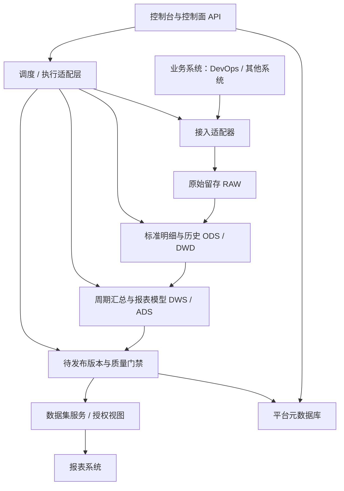

# 02 总体架构与详细设计

状态：设计基线；组件及容量待 PoC 冻结。以下是本项目的实现约束，不代表功能已经实现。

## 1. 分离控制面、执行面与数据面

- 控制面：模块化单体起步，管理契约、版本、授权、运行投影；API 进程不直接承载长时间 ETL。
- 执行面：选定的编排器调度接入、SQL、质量和发布任务；Worker 与查询服务隔离账号及资源。
- 数据面：平台元数据库、业务加工库和报表服务空间逻辑隔离；是否独立实例由压测和恢复要求决定。
- 不直接修改开源组件元数据库。通过版本明确的 API/CLI/任务协议整合，保留替换边界。

## 2. 自研与复用

| 能力 | 平台自己维护 | 可委托执行组件 |
|---|---|---|
| 数据接入 | 来源契约、凭证引用、检查点和批次关系 | 连接器、分页/读取、写入 |
| 调度 | 工作流版本、平台运行ID、授权 | DAG依赖、执行队列、重试、超时 |
| SQL开发 | 模型登记、审核、业务版本 | SQL编译、执行、测试、模型依赖 |
| 质量 | 规则归属、门禁策略、豁免审批 | SQL校验或质量执行框架 |
| 发布与查询 | 数据集契约、发布指针、权限、数据截止时间 | 底层数据库查询、受控缓存 |
| 治理 | 稳定对象ID、运行和来源映射 | 后续元数据目录和血缘平台 |

一期不同时自研调度器、分布式接入引擎和通用指标引擎。指标目录记录语义与汇总方式，计算先使用经测试的 SQL 模型。

## 3. 一期部署建议

- 本地/测试：容器化启动被选组件；业务模型和任务定义与应用代码一起版本管理。
- 生产：独立执行账号；控制面、执行面、查询面具有资源边界；数据库备份、TLS、密钥托管、日志采集和故障恢复演练。
- 一期候选存储以关系型数据库为基线；大明细量、高扫描或高并发触发列式分析库 PoC。
- 不给出未测量的服务器数量。记录每日增量、行宽、历史长度、最大查询扫描量、并发和重算窗口后确定规格。
- 开发/测试/生产至少实现数据库、凭证和发布权限隔离；测试使用脱敏或合成数据。

## 4. 平台模块

`source` 数据源与接入；`model` 主题与模型；`workflow` 任务版本和执行适配；`quality` 规则及结果；`metric` 口径登记；`dataset` 契约与发布；`access` 授权和审计；`operations` 日志、告警、补数。

业务主题放在独立目录/命名空间，如 `domains/devops`，不得将需求、缺陷状态判断写入通用执行模块。

## 5. 核心元数据实体（逻辑结构）

| 实体 | 核心字段 | 关键约束 |
|---|---|---|
| source_connection | id, code, type, config, credential_ref | code唯一；不存明文密码 |
| ingestion_job | id, source_id, object_name, strategy, cursor_spec | 每源对象明确主键/删除/检查点策略 |
| ingestion_batch | id, job_id, cursor_from/to, state, row_count, checksum | 写入成功后才推进检查点 |
| subject / data_model | id, subject_id, layer, grain, key_spec, history_policy | 模型编码稳定；粒度必填 |
| model_version | id, model_id, schema, sql_ref, checksum, status | 发布后不可覆盖；SQL内容可复现 |
| workflow_version | id, workflow_id, dag, version, checksum | DAG无环；与模型版本绑定 |
| run_instance | id, workflow_version_id, interval, attempt, engine_run_id | 逻辑运行与重试attempt分离 |
| metric_definition | code, version, meaning, time_basis, aggregation, unit | 统计总体、样本和归属规则明确 |
| quality_rule / result | rule_version, run_id, measured, expected, severity | 结果关联数据版本；规则不可事后覆盖 |
| dataset_version | id, dataset_id, schema, grain, dependencies, policy_ref | 契约版本独立于每次数据刷新 |
| dataset_release | id, dataset_version_id, manifest, watermark, state | 发布记录不可变；manifest指向完整结果 |
| dataset_active_release | dataset_id, release_id, revision | 比较并交换；防止旧批次覆盖新批次 |
| access_policy / audit_log | principal, resource, scope, action, time | 查询和下钻同一授权边界 |

主键、索引、外键与分区 DDL 在选定数据库后形成迁移脚本，不在技术栈未确定时伪造最终 DDL。

## 6. 接口草案

统一 `/api/v1`，时间使用带时区格式；控制类写操作留审计。以下为平台契约草案，不假定开源组件原生提供同名接口。

| 接口 | 用途/关键约束 |
|---|---|
| POST /sources; POST /sources/{id}/test | 登记和测试；响应脱敏；限制出站网络目标 |
| POST /models; POST /models/{id}/versions | 登记模型和不可变版本 |
| POST /workflows/{id}/runs | 参数含 interval_start/end、版本；返回202和run_id |
| GET /runs/{id} | 返回步骤状态、批次、日志引用、错误分类 |
| POST /workflows/{id}/backfills | 必须指定范围、版本、目标层、并发限制；审批后运行 |
| GET /datasets/{id}/schema | 字段、粒度、单位、允许聚合方式 |
| POST /datasets/{id}/query | 结构化字段/过滤/排序/分页；禁止客户端任意SQL |
| GET /datasets/{id}/releases | 口径版本、数据截止时间、质量、当前发布 |
| POST /datasets/{id}/releases | 检查依赖/权限/门禁后发布；请求幂等 |

查询必须带或解析可信身份；过滤字段白名单、参数化查询、行数和耗时限额。运行重试使用幂等键，不依赖HTTP调用“恰好一次”。

## 7. 数据集发布一致性

1. 在 staging 或版本化目标中构建本次结果，不直接覆盖当前服务表。
2. 固定输入数据截止时间、模型版本、指标版本、维度版本，写入发布清单。
3. 对新结果执行质量、对账、依赖完整性检查。
4. 确认所有数据对象已持久化且可读，再在元数据库事务中比较并切换 active_release。
5. 查询入口只解析一次 release_id；一次查询/下钻固定使用该版本。
6. 发布失败保持原指针；旧版本在保留期及活跃查询结束后清理。

跨数据库不假定存在分布式事务。按分区发布时，manifest必须描述全部可见分区及其版本，不能只列本次变化分区。乱序完成的旧任务不可覆盖新发布。

如果报表只能直连 SQL，需验证数据库支持的事务视图切换或等价版本路由方案；多表原子可见性不能只用逐表重命名实现。该能力是存储PoC的阻断项。

## 8. 权限与安全设计

- 来源账号只读；执行账号只能操作限定模型空间；报表账号不能读RAW/内部表。
- 数据源连接与SQL开发仅对可信数据开发开放；SQL任务是有风险的代码执行能力，必须审批、隔离和资源限制，不能只靠字符串检测。
- API模式由服务强制行/列权限；SQL直连采用数据库可强制执行的授权视图/行策略或隔离账号。共享账号若不能传递用户权限，不能宣称支持用户级隔离。
- 汇总数据集、明细下钻、导出和缓存均采用同一组织/团队策略；缓存键包含身份范围和release_id。
- 凭证只存引用，日志不输出密钥或完整敏感响应；数据与备份保留期需业务确认。
- 管理维度的历史归属与当前访问权限分开：不能因报表统计历史团队而自动给已转岗人员历史访问权。

## 9. 运行状态与恢复

运行：QUEUED → RUNNING → SUCCEEDED / FAILED / CANCELLED；发布另有 BUILDING → VALIDATING → READY → PUBLISHED / REJECTED。

同步失败只重试未提交的批次；转换失败不推进发布；质量失败隔离数据并阻断指定数据集；运行回调去重，并定期对账引擎真实状态；执行恢复和数据发布恢复不能混为一谈。
