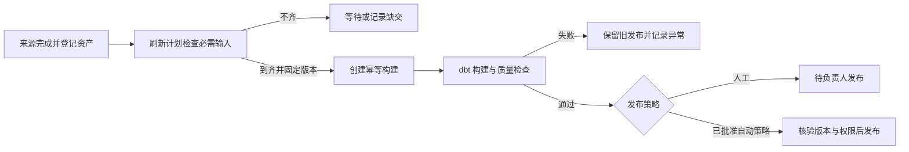

# 下一批实施方案：接入工作台与自动数据交付

状态：供用户评审的实施方案，尚未开始本批代码开发。日期：2026-09-16。基线：`3a880ef`、[PR #1](https://github.com/hiblacker/jiuzhang/pull/1)（本次查询仍为 OPEN，等待人工评审）。一期事实见 [37 号验收](37-phase-one-acceptance.md)，本批详细验收见 [39 号契约](39-next-product-acceptance-contract.md)。

## 1. 建议做什么

**下一批把九章做成数据团队可以日常独立使用的工作台：通过界面接入来源，按规则自动产出数据集，发现异常后能够定位和处理。**

交付目标是下面三条完整使用流程：

1. **接入一个来源**：进入项目 → 选择执行环境与凭证引用 → 测试连接/目录 → 发现结构 → 确认接入范围和每日交付规则 → 启动 → 查看资产。
2. **持续交付一个数据集**：选择 Git 模型 → 映射输入资产 → 构建与检查 → 首次审核发布 → 设置自动刷新 → 每天按已批准规则生成候选或发布版本。
3. **处理一次异常**：首页看到缺交/失败/数据过期 → 定位来源、窗口和影响的数据集 → 补采/重解析/重建 → 查看质量和发布结果 → 关闭异常。

两人开发按可运行结果推进，使用 AI 完成实现、测试和文档；不按工时排期。每个切片包含前后端和验收，可以单独演示、提交和评审。

## 2. 当前产品差距：来自代码，而非重新估计一期进度

| 当前事实 | 日常使用的阻碍 | 本批处理 |
|---|---|---|
| 页面直接填写 API 地址、Token，多个表单在一个 HTML 中 | 日常入口、项目导航和状态反馈不统一 | 正式前端工程、同源访问、会话登录、项目导航 |
| 来源登记、执行配置、inventory 分散；Worker 从本地注册表启动 | 新来源仍需开发者编辑服务器 JSON 并重启进程 | 管理员一次登记资源边界；项目内通过表单配置、异步测试发现和版本生效 |
| 来源/接入 API 主要使用平台管理员身份，项目身份主要覆盖 warehouse API | 数据开发无法完整操作自己项目的接入流程 | 项目范围扩展到接入、计划、运行和发现；Worker 仍使用执行身份 |
| 模型登记依赖 Git SHA、包摘要与 JSON；构建输入为 `mysql:123` 等 ID | 使用者需要理解内部标识并手工拼契约 | 选择式模型登记、输入资产映射、粒度/字段/规则表单 |
| 入湖有日历，模型构建和发布由单独接口手动请求 | 每日原件更新后，报表数据集可能一直停留在旧版本 | 数据集刷新计划、完整输入选择、幂等触发与受控发布 |
| 模型影响接口比较契约片段；运行依赖记录在包和输入中 | 不能直接看到上游缺交影响哪些结果 | 资产至模型/数据集的依赖详情、变更影响和数据截止时间 |
| 已有质量结果、查询和审计基础；查询主要为等值条件及限量分页 | 质量处置、报表接入、权限调整和问题排查仍偏技术操作 | 质量结果页、数据集服务页、异常中心、查询审计及时间范围筛选 |
| 源列表页面只取首批，部分后端列表固定 LIMIT；当前没有仓库 CI 工作流 | 对象增长后可能看不到记录，协作缺少自动回归入口 | 服务端分页/筛选、前端列表状态；无真实源凭证的合成 CI |

证据入口：[当前页面](../apps/console/index.html)、[来源接口](../apps/control-api/src/main/java/com/bydw/source/SourceController.java)、[身份过滤](../apps/control-api/src/main/java/com/bydw/api/RequestAuthenticationFilter.java)、[模型服务](../apps/control-api/src/main/java/com/bydw/warehouse/ModelService.java)、[模型登记器](../apps/model-worker/register.py)、[查询服务](../apps/control-api/src/main/java/com/bydw/warehouse/DatasetQueryService.java)。一期功能验证仍成立；本表描述新增产品工作。

## 3. 用户、角色与页面

### 3.1 角色

| 角色 | 本批常用操作 | 服务端边界 |
|---|---|---|
| 平台管理员 | 初始化用户、登记执行环境/目录根/凭证引用、资源授权、查看平台健康 | 明确的管理入口；管理操作留审计 |
| 项目负责人 OWNER | 管成员和来源授权、审核模型/发布策略、发布候选、授权数据集 | 仅限本项目及已获授权的执行资源 |
| 数据开发 ENGINEER | 配置项目来源/计划、发现结构、补采、维护模型和质量规则、构建候选 | 不能自行扩大目录/出站网络/凭证范围，不能批准自己的资源扩权 |
| 数据使用者 VIEWER / 报表服务身份 | 查找已授权数据集、查询和导出、查看数据截止时间 | 行列权限贯穿查询、导出和服务接口；不获得原始湖区访问权 |

浏览器使用标准会话登录；报表与 Worker 使用独立服务身份。建议本批采用 Spring Security 标准实现邀请开户、密码设置/重置、停用与会话撤销；不自研密码协议。组织 OIDC 在提供接入条件后再接入，保留统一身份映射。

### 3.2 信息架构

| 一级入口 | 主要页面 | 用户应立即得到的答案 |
|---|---|---|
| 工作台 | 今日交付、数据新鲜度、待处置事项 | 今天哪些来源没到、哪些数据集过期、谁来处理？ |
| 数据接入 | 来源、发现与覆盖、交付规则、计划版本 | 接什么、何时到、是否到齐、按哪个规则运行？ |
| 资产目录 | 搜索/筛选、表结构、版本、来源、依赖 | 这份数据是什么、来自哪里、哪个版本可用？ |
| 数据开发 | Git 模型、输入映射、质量规则、构建、刷新计划 | 怎样把已接入数据变成可使用的数据集？ |
| 数据服务 | 已发布数据集、字段说明、授权、查询、导出、调用示例 | 我能用什么，数据截至何时，如何接到报表？ |
| 运行中心 | 执行历史、交付日历、异常、恢复记录 | 为什么失败，影响什么，采取哪个恢复动作？ |
| 项目与设置 | 成员、服务身份、资源授权、基础配置 | 谁能操作、谁能用数据、哪些资源已开放？ |

优先用表格、详情页、步骤表单与状态标签。统一加载、空结果、无权限、等待、失败、过期和恢复状态；技术错误码放在可展开详情，并提供可读说明和 requestId。菜单和按钮根据权限显示，后端仍独立校验。

## 4. 本批工作包与实施顺序

| 顺序 / 工作包 | 可交付结果 | 主要改动 | 出口 |
|---|---|---|---|
| A / PROD-01 工作台基础 | 用户登录、项目切换、角色导航、来源/运行列表可用 | Vue/TS 工程、会话与身份 API、统一 API 客户端、服务端分页、合成 CI | 不用填写 API 地址；两项目权限隔离；超过一页的对象可完整查找 |
| B / PROD-02 接入工作台 | 在授权资源内新增来源并得到第一批资产 | 执行资源目录、配置版本、Worker 测试/发现任务、MySQL/文件/API 步骤表单 | 用户无需手填 inventory 或编辑 Worker JSON；测试/发现由实际 Worker 执行 |
| C / PROD-03 模型与资产工作台 | 从资产选择输入、登记固定 Git 模型、构建和查看质量 | 资产详情/元数据、模型包管理、可视化输入映射、dbt 依赖与质量结果 | 不手填资产 ID/模型摘要；SQL 更新不必重建 Worker 应用镜像；依赖可追溯 |
| D / PROD-04 自动数据交付 | 入湖完成后按规则刷新数据集 | 刷新计划、输入完整性与同批次选择、幂等键、补算与发布策略 | 重放不重复构建；缺输入不发布；质量失败保旧；更正生成新版本 |
| E / PROD-05 消费与运营 | 报表能接入，异常能处理，责任可追溯 | 数据集字段说明、查询条件/示例、行列权限表单、查询审计、异常中心 | 身份停用即时生效；查询/导出固定版本；故障可定位并按实际结果恢复 |
| F / PROD-06 集成与试运行 | 可安装、可升级、可演示的下一版产品 | 旧前端切换、迁移和配置兼容、完整验收、真实窗口观察 | 三条主流程通过；旧 release 可用；安装/升级/恢复与限制有证据 |

建议 A→B→C→D→E→F。异常事件的持久化与请求审计从 A/B 随功能加入，E 集中提供运营界面，避免最后补记无法恢复的历史。质量接口随 C 开发，D 复用；不分别维护两套质量判断。

**第一个可演示结果定为 B：一个项目成员登录，在已授权环境中配置目录来源，系统识别到齐文件并生成资产。** 随后将同一条来源接到 C/D，演示第二天自动产生新候选及受控发布。

## 5. 关键产品契约

### 5.1 可配置接入

- 管理员先登记执行环境的能力、允许的目录根、网络目标与凭证引用。项目表单只选择已授权资源；实际秘密仍留在运行环境，不回传浏览器。
- 普通来源参数保存在版本化配置中。Worker 在任务领取时确认配置版本/摘要与自身资源权限，不能一边运行一边切换配置。修改影响后续运行，旧执行保持原版本。
- MySQL：测试连接 → 发现表 → 显示全库覆盖/不支持对象 → 默认整库每日快照 → 预检容量与时间限制 → 启动。结构变化沿用现有审批。
- 文件：选择目录资源及相对目录、格式和解析规则、日期分区、单文件/多文件交付、完成信号、合法空交付、到达时间与迟到窗口。外部工具只需按契约落目录。
- API：固定批准地址、认证引用、分页方式、响应记录路径、时间窗口、终止条件、限流。测试返回有界脱敏结果；不把 HTTP 200 当作接入成功。
- 测试连接和发现是异步任务。页面收到任务 ID 后查看状态，API 不执行长读取。真实源的 TLS 例外继续限定于已有明确授权。

### 5.2 从入湖自动刷新数据集

- 一个刷新计划绑定项目、数据集、已批准模型版本、输入选择规则、业务时区、截止时间、迟到/修订策略与发布模式。
- 同一 MySQL 来源的多表默认来自同一完整系统快照；每日文件引用同一闭合交付版本。跨源可以声明同业务日及允许的到达延迟，但仍记录每个来源实际时点，不宣称跨源事务一致。
- 输入到齐时固定资产 ID/版本，之后重试沿用这组输入。更正产生新的输入集合和构建，不能在旧构建中偷换“最新”数据。
- 首次发布和模型/结构/权限发生不兼容变化时必须人工确认。负责人可为固定兼容契约开启自动刷新发布；默认人工发布，禁止把“构建通过”直接解释成任意版本可自动上线。
- 继续复用入湖日历、执行队列、模型队列、完成账本和比较更新。dbt 负责模型包内部依赖；本批不建设任意跨数据集 DAG 编辑器。

### 5.3 建模、质量与消费

- SQL 仍在 Git 中开发。管理员登记可信仓库，页面选择提交/模型路径，后台读取契约并生成不可变模型包；Worker 按摘要获取和校验。模型包与 Worker 应用镜像分开版本化。
- 表单记录主题、逻辑层级、粒度、唯一键、字段、来源时间和更新频率；RAW/DWD/DWS/ADS 是逻辑分类，不强制多次物化同一份数据。
- 沿用非空、唯一、类型检查；增加声明式枚举、范围、引用关系、行数差异与新鲜度规则。规则版本随候选冻结，展示实测值、阈值及阻断/提示原因。自定义 SQL 测试只来自固定 Git 模型。
- 依赖首先覆盖来源→资产版本→模型/dbt 节点→数据集 release；采用 dbt manifest 的节点关系，不自行解析任意 SQL 构建字段级血缘。
- 数据集页面给出中文名称、字段解释、粒度、可用版本、实际截止时间、刷新频率、质量状态、负责人和调用示例。查询支持有类型约束的等值、集合、时间/数值范围及有界排序，不开放任意用户 SQL。
- 查询审计记录身份、数据集、release、权限版本、字段、条件摘要、行数、耗时、结果与 requestId；不记录业务结果行或敏感筛选原值。导出沿用相同权限与版本。

## 6. 技术实施与边界

- **前端沿用已确认栈**：Vue 3 + TypeScript + Vite + Naive UI，路由和状态库按实际需要引入。先锁精确版本、Node 兼容、lockfile 与许可证，再安装；不在方案中虚构已验证的版本组合。国内 npm 源、Aliyun Maven 与清华 Python 路线延续既有要求。
- **后端沿用 Java/Spring Boot + PostgreSQL**，先补稳定 DTO、统一分页/筛选、项目授权和契约测试，再逐页迁移。会话使用 HttpOnly cookie、过期/撤销和请求防护；Cookie 的 Secure/TLS 按部署环境配置。服务 Token 与浏览器登录分开。
- **执行层沿用现有 Node/Python Worker 和 dbt 锁**；刷新触发只做产品所需的依赖就绪协调。SeaTunnel/DolphinScheduler 的正式整合在需要其能力时单独验收。
- **运行观测**：来源和数据集分别显示健康/新鲜度；旧发布可查询但过期必须可见。记录待执行、失败、缺交、Worker 失联、存储预算等状态。站内异常支持确认、责任人、处置记录和基于真实恢复结果的关闭；外部通知作为可配置扩展。
- **存储**：呈现原件、模型、失败尝试和备份的占用与预算，提供保留期建议及引用检查。自动物理删除不纳入本批；活跃 release、恢复链和仍被引用的原件必须保护。
- **交付**：应用依赖、模型包、配置、迁移和数据 release 分别版本化；已有 V001–V017 保持不变，新迁移编号以合并时仓库实际状态分配。CI 使用合成数据及隔离数据库，不读取真实测试源或提供生产密钥。

本次核对的官方依据：Vue 官方建议 Vite 工程配合独立 `vue-tsc` 类型检查；Naive UI 与 Vue/TypeScript 配套，组件图片资源需同时核对相应署名条件。[Vue TypeScript](https://vuejs.org/guide/typescript/overview.html)、[Naive UI 仓库](https://github.com/tusen-ai/naive-ui)。dbt 的构建与依赖产物可支撑执行和节点血缘，实际适配仍按本项目固定 v1 版本验证。[dbt build](https://docs.getdbt.com/reference/commands/build)、[manifest](https://docs.getdbt.com/reference/artifacts/manifest-json)。本次未安装或升级依赖。

## 7. 下一批不扩张的范围

| 后续能力 | 启动条件 |
|---|---|
| CDC/逐表增量 | 实测全量超出运行窗口，且游标/删除或 binlog 语义、权限与恢复验证成立 |
| Iceberg/分析引擎/对象存储迁移 | 有明确多引擎、查询容量或存储需求，先通过同等故障与权限验收 |
| 完整在线 SQL IDE、拖拽 ETL、任意跨数据集 DAG | 上述三条主流程已被真实用户使用，并证明当前 Git/dbt 方式成为主要阻碍 |
| 业务指标全集 | 首个主题负责人确认口径、时间/删除/历史规则及黄金样本 |
| NAS/生产部署、外部通知通道和组织 SSO | 获得具体环境、身份/通知渠道和部署授权；本地验收不替代这些条件 |

## 8. 验收方式与完成定义

详细案例见 [39 号契约](39-next-product-acceptance-contract.md)。本批不以页面数量或接口数量判断完成，必须同时达到：

1. 授权资源已初始化后，另一位使用者依操作手册完成“来源→资产→模型→发布→授权查询”，日常流程无需终端、JSON 或内部资产 ID；SQL 编辑仍在 Git。
2. 数据库、每日目录和模拟 REST 三种来源均能走同一工作台流程；真实目录/API 尚未提供时，验收记录明确区分合成与真实。
3. 至少一个固定模型的每日自动刷新通过：到齐、迟到、合法空交付、重复、更正、质量失败、旧任务晚完成、停机恢复；数据截止时间和发布版本正确。
4. OWNER、ENGINEER、VIEWER 和服务身份的正向/越权测试覆盖来源、资产、运行、查询、导出和授权撤销；菜单隐藏不能替代接口测试。
5. 老版本真实数据集及其 release 在升级后仍可查询，已有模型及入湖规则能够迁移；功能切换不重跑全部源库、不改写历史。
6. 新版 UI 类型检查/构建、关键行为测试、现有相关回归、隔离集成及浏览器主流程通过；输出真实通过/失败/跳过数。
7. 开发交付先用可控时钟/缩短窗口验证机制；无人值守试运行另观察建议 **7 个实际每日交付窗口**，记录缺交、延迟、源读取与存储变化。这是稳定性观察，不是开发工时或尚未发生的成功记录。

## 9. 第一组真实数据产品与待补输入

先把已有真实 VERSION 投影补齐字段说明、依赖、数据截止时间、自动刷新和服务授权，验证“每天可持续供数”。再选择一个经业务确认的主题，交付当前明细、每日快照及一个有依据的汇总；不得把快照差异当完整变更事件。

需要后续提供的输入：真实文件根目录与到齐规则、真实 API 分页/认证/业务成功契约、首批数据使用者与报表调用方式、首个主题的字段/时间/状态规则。未得到这些输入时，平台功能用合成夹具推进，真实接入和业务数据发布保持待验收。

## 10. PR 与实施管理

PR #1 的修复意见优先处理，当前 PR 范围保持稳定。本方案单独保存到 `codex/next-product-plan` 并本地提交，不追加到正在审批的 PR。

后续开发建议按 A–F 分为 6 个可评审 PR，每个 PR 含垂直功能、契约/迁移、测试和恢复说明；不得再次将全部工作积攒成一个大 PR。每个切片先完成其出口，避免为了页面细节反复扩大测试或重新选型。PR #1 合并后从新基线分支开始；如果以 squash 合并，后续分支只迁移本批新增提交，避免把一期 20 个提交重新引入。

**建议确认的本批目标：完成 A–F，即“接入可配置、数据集可自动交付、日常异常可运营”，以现有原件、权限、发布与恢复机制为基础继续建设。**
